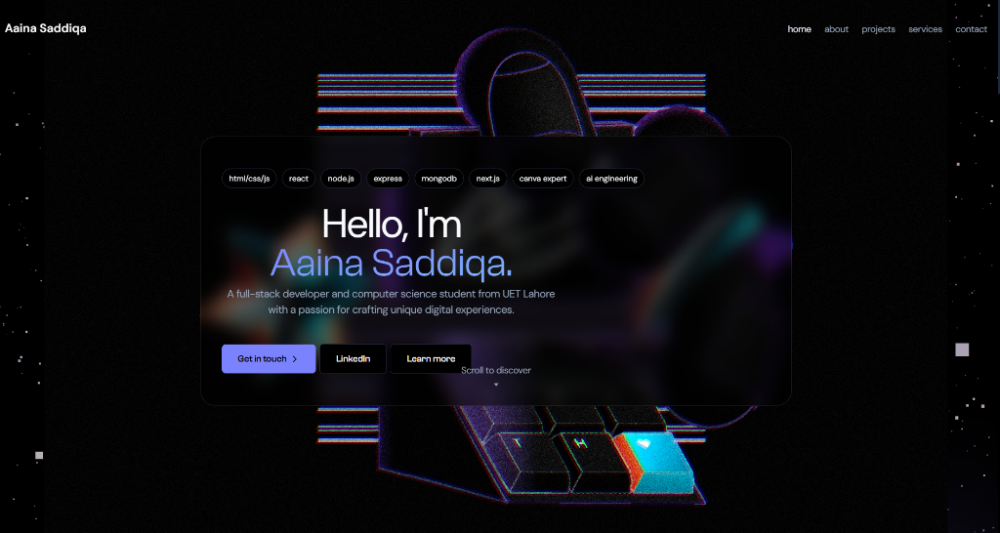
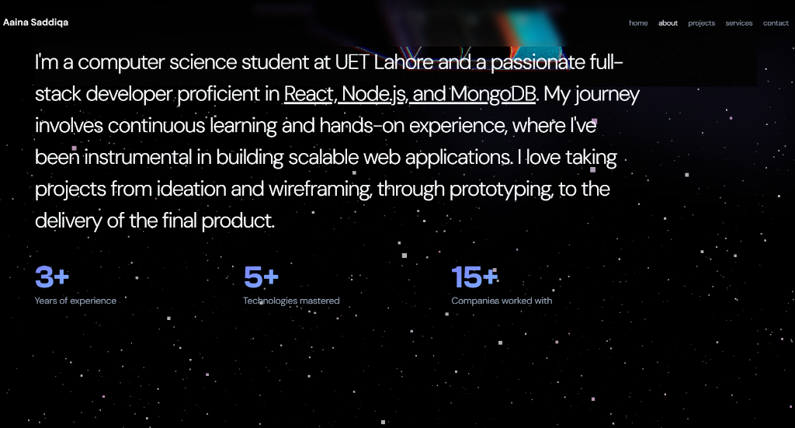
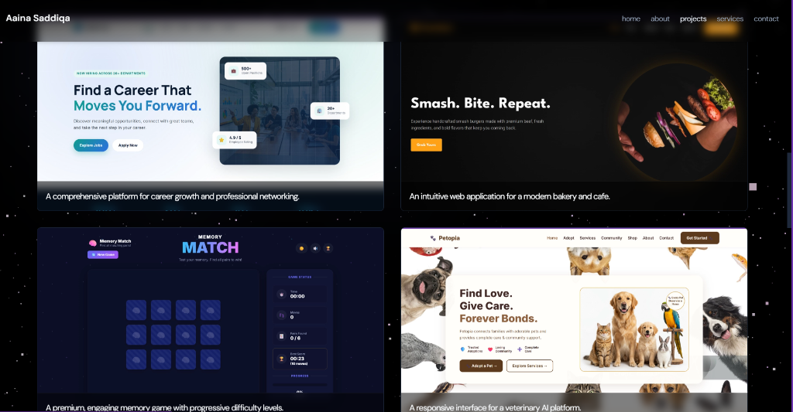
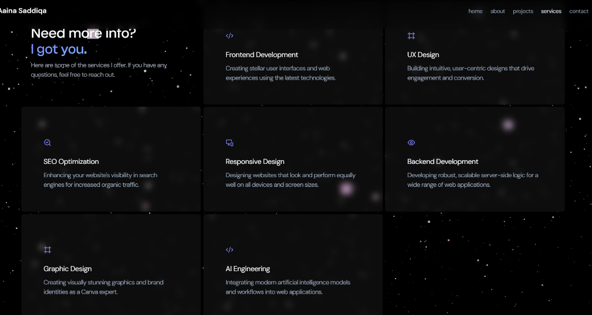

 Developer Portfolio

A premium, interactive, and highly responsive 3D developer portfolio built with Next.js, React, Tailwind CSS, and Framer Motion. 
Features a stunning dark glassmorphism aesthetic, interactive Spline 3D backgrounds, and smooth scroll animations.

## 🌟 Live Demo
*(Add your Vercel or Netlify deployment link here)*

## 📸 Screenshots

### Hero Section


### About & Skills


### Projects Showcase


### Services


## 🚀 Technologies Used
- **Framework:** Next.js (React)
- **Styling:** Tailwind CSS & Custom CSS Modules
- **Animations:** Framer Motion & Locomotive Scroll
- **3D Graphics:** Spline (@splinetool/react-spline)
- **UI Components:** Shadcn UI (Radix Primitives)
- **Icons:** Lucide React

## 💻 Running Locally

1. Clone the repository:
   ```bash
   git clone https://github.com/aaina25-bot/portfoliodecodelabs.git
   ```
2. Install dependencies (uses pnpm):
   ```bash
   pnpm install
   ```
3. Start the development server:
   ```bash
   pnpm dev
   ```
4. Open [http://localhost:3000](http://localhost:3000) in your browser.

## 📁 Project Structure
- `src/pages/index.tsx` - Main single-page layout
- `src/components/` - Reusable UI components (Preloader, ParticleBackground, Gradient)
- `src/styles/` - Global styles and CSS modules
- `public/assets/` - Static assets, images, and Spline 3D models


